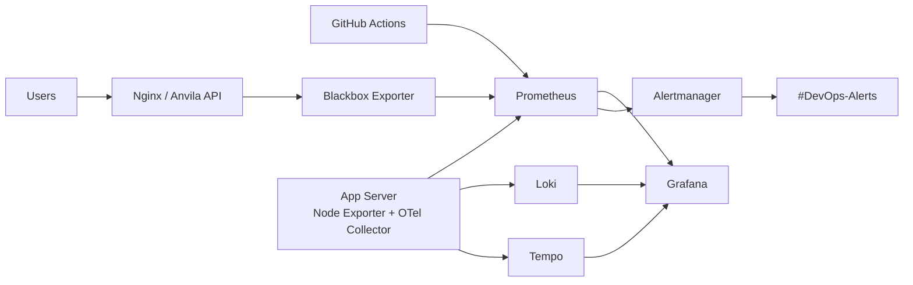

# Anvila Observability Platform

Production-grade observability stack for the Anvila API using LGTM:

- Loki for logs
- Grafana for dashboards
- Tempo for traces
- Prometheus for metrics
- Alertmanager for Slack alerts
- Node Exporter and Blackbox Exporter for infrastructure and uptime monitoring
- OpenTelemetry Collector for logs and traces

The monitoring stack is designed to run on a dedicated AWS EC2 monitoring server using systemd services. Docker is intentionally not used on the server.


## Known Targets

| Environment | URL | App server | Port |
| --- | --- | --- | --- |
| Staging | `https://api.staging.anvila.hng14.com` | `13.60.76.205` | `8000` |
| Production | `https://api.anvila.hng14.com` | TBD | `8001` |

The current first-class monitoring target is staging because the app server IP is known.

## One-Command Deployment

After filling `terraform/terraform.tfvars`, run:

```bash
cd terraform
terraform init
terraform apply
```

Terraform creates the monitoring EC2 instance, opens the required monitoring ports, uploads all LGTM configuration, and starts systemd services through the bootstrap script.

## Required Values Before Final Deployment

Fill these in `terraform/terraform.tfvars`:

```hcl
aws_region              = "us-east-1"
key_name                = "your-aws-keypair-name"
ssh_private_key_path    = "~/.ssh/your-key.pem"
monitoring_allowed_cidr = "YOUR_PUBLIC_IP/32"
slack_webhook_url       = "https://hooks.slack.com/services/..."
```

Still needed from the team:

- AWS key pair name for the monitoring EC2 instance
- SSH private key path on the machine running Terraform
- confirmed AWS region
- production app server IP
- Slack incoming webhook for `#DevOps-Alerts`
- whether the Python API exposes `/metrics`
- whether the API runs as a systemd service, PM2 process, or another process manager
- actual app log paths or journal service name

For a beginner-friendly explanation of these values, see `docs/beginner-deployment-checklist.md`.

Current deployed monitoring server:

```text
Grafana: http://34.204.43.206:3000
Prometheus: http://34.204.43.206:9090
Alertmanager: http://34.204.43.206:9093
```

The app currently runs with Nginx and PM2:

```text
backend-staging: port 8000
backend-production: port 8001
```

Staging instrumentation instructions are in `docs/app-instrumentation.md`.

## Architecture



## Default Ports

| Component | Port |
| --- | --- |
| Grafana | `3000` |
| Prometheus | `9090` |
| Alertmanager | `9093` |
| Loki | `3100` |
| Tempo | `3200`, OTLP gRPC `4317`, OTLP HTTP `4318` |
| Blackbox Exporter | `9115` |
| Node Exporter | `9100` |

## Dashboards

Provisioned dashboard JSON files live in `config/grafana/dashboards`.

- DORA Metrics
- SLO & Error Budget
- Node Exporter
- Blackbox Exporter
- Unified Observability

## Error Budget Policy

For the main availability SLO, Anvila targets 99.5% successful probes over 30 days.

- 0-50% budget consumed: normal delivery continues.
- 50-75% consumed: team reviews recent failures and prioritizes reliability fixes in the next sprint.
- 75-100% consumed: new risky feature deployments require approval from the Anvila DevOps team.
- 100% consumed: feature freeze for the affected service until reliability is restored or the team explicitly accepts the risk.

SLOs should be reviewed weekly during the task period and monthly in normal production operation.

## Team

- Bimbo_og
- DorcasBD
- nyson

Incident ownership: Anvila DevOps team.
